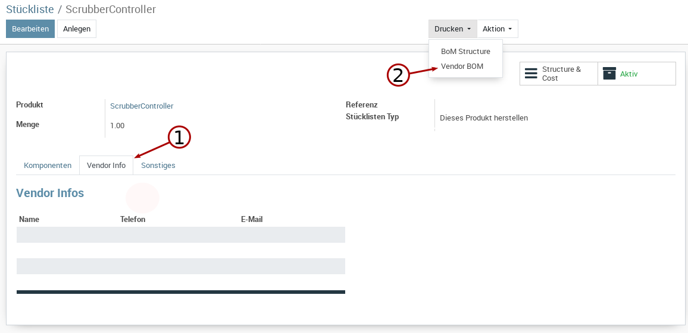

.. image:: https://img.shields.io/badge/license-AGPL--3-blue.png
   :target: https://www.gnu.org/licenses/agpl
   :alt: License: AGPL-3

===============================
Sida Vendor BOM 
===============================

This module allows to generate custom BOM reports including vendor information for all components.

Description
-----------

* Adds the notebook page *Vendor Info* which allows to add vendors.
* Adds the print menu *Vendor BOM* which generates a table of all components and the vendor information (vendor code) of the added vendors..

Chagelog
--------
* 2019-01-04: init

